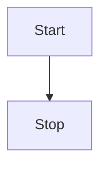

# 拡張機能

<!-- toc -->

## mdbook-mermaid

* <https://github.com/badboy/mdbook-mermaid>

Mermaidによる図を記述できます。GitHubと同じ記述方法です。

````md

````

以下のようにレンダリングされます。

---


---

### セットアップ方法

まず`mdbook-mermaid`をインストールします。

```
cargo install mdbook-mermaid
```

バイナリを直接ダウンロードして直接配置することもできます。

```
$HOME/.cargo/bin
```

次に以下のコマンドを実行します。mdBookで使用するJavaScriptファイルがコピーされます。

```
mdbook-mermaid install ./js
```

最後に`book.toml`に追記し有効化します。

```toml
[preprocessor.mermaid]
command = "mdbook-mermaid"

[output.html]
additional-js = ["./js/mermaid.min.js", "./js/mermaid-init.js"]
```

## mkdook-alerts

* <https://github.com/lambdalisue/rs-mdbook-alerts>

GitHubと同じ記述方法で、注記が記述できます[^1]。

```md
 > [!NOTE]
 > ノート

 > [!TIP]
 > チップ

 > [!IMPORTANT]
 > 重要

 > [!WARNING]
 > 警告

 > [!CAUTION]
 > 注意
```

以下のようにレンダリングされます。

---

> [!NOTE]
> ノート

> [!TIP]
> チップ

> [!IMPORTANT]
> 重要

> [!WARNING]
> 警告

> [!CAUTION]
> 注意

---

[^1]: プリプロセッサの動作を抑制するため、行頭に余計なスペースが入っています。

### セットアップ方法

`mdbook-alerts`をインストールします。

```
cargo install mdbook-alerts
```

`book.toml`に追記し有効化します。

```toml
[preprocessor.alerts]
```

## mdbook-toc

* <https://github.com/badboy/mdbook-toc>

以下のように記述することで、チャプター内の目次が生成されます。

```md
<!-- toc -->
```

### セットアップ方法

`mdbook-toc`をインストールします。

```
cargo install mdbook-toc
```

`book.toml`に追記し有効化します。

```toml
[preprocessor.toc]
command = "mdbook-toc"
renderer = ["html"]
```

## mdbook-emojicodes

* <https://github.com/blyxyas/mdbook-emojicodes>

GitHubと同様の記述方法で絵文字が使用できるようになります。

```md
:sparkles:
```

以下のようにレンダリングされます。

---

:sparkles:

---

### セットアップ方法

`mdbook-emojicodes`をインストールします。

```
cargo install mdbook-emojicodes
```

`book.toml`に追記し有効化します。

```toml
[preprocessor.emojicodes]
```

## mdbook-pdf

* <https://github.com/HollowMan6/mdbook-pdf?tab=readme-ov-file>

ヘッドレスブラウザを用いて、PDFを出力するバックエンドです。ビルドと同時にPDFが自動で出力されますが、PDF出力に時間がかかるため、`serve`コマンドとの相性は悪いです。

### セットアップ方法

`mdbook-pdf`をインストールします。

```
cargo install mdbook-pdf
```

`book.toml`に追記し有効化します。`serve`コマンド実行時にもPDFが出力されるため、ホットリロードのレスポンスが悪くなることに注意してください。

```toml
[output.pdf]
```
