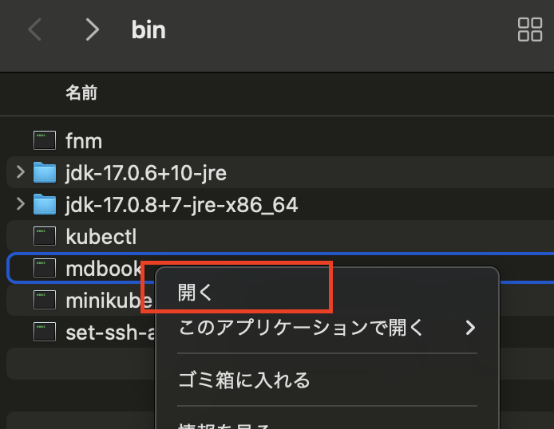

# mdBookを始める

## 公式サイト

* <https://github.com/rust-lang/mdBook?tab=readme-ov-file>
* <https://rust-lang.github.io/mdBook/>

## インストール

### プレビルドバイナリを使用する

GitHubのReleaseからバイナリを取得してパスを通します。

* <https://github.com/rust-lang/mdBook/releases>

#### macOSでの初回起動

プレビルドバイナリは署名が入っていないため、macOSではGatekeeperに弾かれます。初回は右クリックの「開く」から実行するか、システム設定から許可してください。




Cargoからインストールした場合は自分でビルドしたバイナリを使うことになるため、この操作は必要ありません。

### Cargoを使う

Rust (1.74以降) の環境が整っていれば、`cargo`を使うのも良いでしょう。特にプリプロセッサなどを拡張する場合、`cargo`を使ってインストールすることになるため、 初めから`cargo`で環境を整えても良いです。

```
% cargo install mdbook
```

crate.ioからインストールされます。バイナリはデフォルトでは`~/.cargo/bin/`に配置されます。`cargo uninstall mdbook`とすることでアンインストールできます。


## ドキュメント作成の開始

ドキュメントの作成は`mdbook`コマンドを利用して開始します。リポジトリルートで実行する場合は以下のようにします。

```zsh
% mdbook init .
```

これで以下のようにファイルが作成されます。

```
/
|-src
|  |- chapter_1.md
|  |- SUMMARY.md
|- book.toml
```

次のコマンドでサーバーが実行され、ブラウザで作成中のドキュメントを確認できます。ホットリロードに対応しており、ドキュメントを編集し保存すると、自動的にリロードされます。

```zsh
% mdbook serve --open
```

次のコマンドでドキュメントをビルドできます。デフォルトでは`book`フォルダに出力されます。

```zsh
% mdbook build
```
